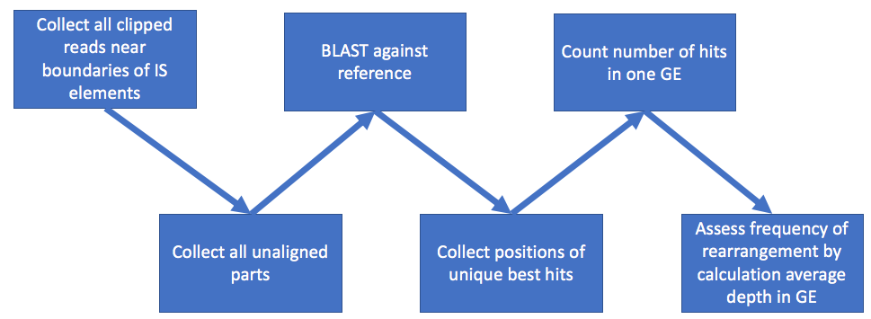
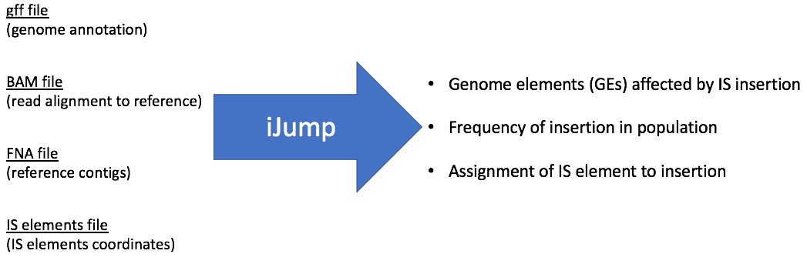

# iJump
Software for search of rearrangements in population sequencing data.
*Program is in developing stage and feedback is appreciated.*

**iJump** searches for IS elements rearrangements in evolved populations of single organism and estimates what fraction of a population is affected by the rearrangement. iJump uses soft-clipped reads to find evidense for rearrangements. In general workflow is following:
1. Find soft-clipped reads near boundaries of mobile elements.
2. Extract unaligned part of reads.
3. BLAST unaligned parts agains reference.
4. Find best hits with >90% identity to the reference with unique highest bitscore. If two ore more hits share the same bit score - the junction considered as ambigious and skipped. Usually this is happening because aligner map reads to several copies of mobile element.
5. Assess frequency of insertion by simple formula *((Rl + Rr) / 2 * ( 1 + Bmin / aRlen)) / (Dt * ( 1 - mmatch / aRlen ))*, where  
	*Rl* - number of reads that support junction to the target on the "left" side of mobile element  
	*Rr* - number of reads that support junction to the target on the "right" side of mobile element  
	*Dt* - average depth of caverage of target region
	*Bmin* - minimum length for unaligned parts that were used in the BLAST step
	*aRlen* - average read length
	*mmatch* - minimum length of the read part that could be aligned to reference. Accessed as the minimum of longest clipped part of the read (*e.g.* for read with CIGAR string 10S120M30S *mmatch* is 30).
	



**NOTE:** Current versio of iJump do not separate different junction events in one target gene. For example, if IS1 element was inserted in gene X three times in different positions, iJump anyway will show one event of unspecified insertion of IS1 element into gene X with summarized frequency.

**NOTE:** Working with short-read-only assembled genomes is difficult with iJump. The reason is that usually IS elements are repetitive regions which are difficult to resolve for assemblers. This often result in shreading IS elements to several/many sometimes overlapped short contigs. This introduce difficulty either for boundaries determination and for mapping algorythms.

## Motivation

Genome rearrangements are powerful powerfull tools for evolution in all domains of life. With current rapid decrease of sequencing costs and introduction of experimental evolution settings into laboratories more population sequencing data will be generated. It is extremely helpful for the research to see not only SNPs and short InDels but also other large rearrangements. Currently very few software tools exists that can work with data of mixed populations, not the clonal ones. The only tool for bacterial population data that was found is a [*breseq*](http://barricklab.org/twiki/bin/view/Lab/ToolsBacterialGenomeResequencing). However although it is an excellent and comprehancise tool we've found it very slow on high coverage data.

In our experiments we found that often rearrangements are happend by mobile elements. To speed up the program we focused specifically on IS mobile elements.

## Installation

**iJump** do not need special installation. Just clone repository:
```
git clone https://github.com/sleyn/ijump.git
```

But it is dependent on several Python libraries:
* **biopython**

    [Installation guidelines](https://biopython.org/wiki/Download)

* **pandas**

    [Installation guidelines](https://pandas.pydata.org/pandas-docs/stable/install.html)
    
* **pysam**

    [Installation guidelines](https://pysam.readthedocs.io/en/latest/installation.html)
    
* **pysamstats**
    [Installation guidelines](https://github.com/alimanfoo/pysamstats)
    
 ## Usage
 
 ### Input
 
 iJump requires four files for input:
 1. File with mobile elements coordinates
 2. Reference DNA contigs fasta file.
 3. GFF file with reference genome annotations.
 4. BAM file of aligned Illumina reads.
 
 
 
 #### Mobile elements coordinates file
 
 File with mobile elements coordinates shoud be tab-separated tables of the following structure:
 ```
 IS_Name    Contig_Name Start_position  End_position
 ```
 
 For example:
 ```
 ISAcsp3	NODE_1	2980551	2981283
 ```

If you don't have file with coordinates of mobile elements you can:

1) Preferred do manual BLAST against standalone ISFinder database. Database could be downloaded from:

- [Author GitHub](https://github.com/thanhleviet/ISfinder-sequences)
- [My Fork](https://github.com/sleyn/ISfinder-sequences) with already built BLASTn database.

Do BLASTn search:

```
blastn -query <Genome> -db <BLASTn database from IS.fna> -out <Output file> -outfmt 6
```

Parse the output table with **isfinder_db_parcer.py** script:
```
python3 isfinder_db_parcer.py -b <BLAST output in outfmt 6 format> -o <Output directory>
```


2) Find them from ISFinder website using their [BLAST](https://isfinder.biotoul.fr/blast.php) against your reference contigs.

It will return you  html page of hits that you can download and parse with **isfinder_parser.py**:
```
python3 isfinder_parse.py -i <ISfinder BLAST HTML page>
```

Both parsers will find non-overlapping hits with empirical E-value threshold 1E-30.

**NOTE:** It was observed that if the contig FASTA header (the line starting with ">") is long then ISFinder BLAST does not produce "Query=" string with the contig name.  This line is critical for `isfinder_parse.py` work. If the script reports empty table please change header by using sorter contig names or removing auxiliary information.

#### Reference Fasta

Regular Fasta file with one Fasta-record per contig:

```
>Contig1
gctagctagctagctacgtagctagctagctacgtacgtacgtagcta...

>Contig2
cgtagctgctagctagctagctagcgtacgtacgtagctacgtacgta...

...
```

#### GFF file

iJump is working with it's own gff module that is tuned for PATRIC/PROKKA-style GFF.

Example:

```
##gff-version 3								
##sequence-region	accn|NODE_1_length_3909467_cov_533.478_ID_22129	1	3909467					
NODE_1_length_3909467_cov_533.478_ID_22129	FIG	CDS	34	336	.	-	1	ID=fig|400667.82.peg.1;product=hypothetical protein;locus_tag=AUO97b_00141
NODE_1_length_3909467_cov_533.478_ID_22129	FIG	CDS	352	1578	.	-	1	ID=fig|400667.82.peg.2;product=phage replication protein Cri;locus_tag=AUO97b_00142
NODE_1_length_3909467_cov_533.478_ID_22129	FIG	CDS	1724	2098	.	+	2	ID=fig|400667.82.peg.3;product=helix-turn-helix family protein;locus_tag=AUO97b_00143
```

If you have another style of GFF unfortunately you have to reformat it at the current stage of development.

#### BAM file

BAM file with aligned short reads. BAM file should contain soft-slipped reads. On the current stage iJump don't use hard-clipped reads. **If you have aligner (like BWA-mem) that produses both soft- and hard-clipped reads you should multiply frequency assessments by 2.**

### Run iJump

iJump run with the following command:

```
python3 isjump.py -a <BAM file> -r <Reference FNA file> -g <Reference GFF file> -i <IS coordinates>
```

### Output

#### ijump_junctions.txt

Contains information about junctions for each read. File contains following columns:

* index  
	 order number
	
* ID  
	 unique identifier
	
* IS name  
	 mobile element name
	
* IS pos  
	 what part of the read matches mobile element
	
* IS chrom  
	 name of contig where mobile element is located in the reference
	
* Read name  
	 read name where jubction was observed
	
* Chrom  
	 name of contig where mobile element jumped
	
* Position  
	 posistion of the junction
	
* Orientation  
	 orientation of mobile element relative to junction
	
* Note  
	 mark if junction is in other mobile elements - usually indicates false positive hits
	
* Locus tag  
	 locus tag of the affected gene; in the case of intergenic region two locus tags will be shown with us_ or ds_ prefixes that indicate upstream or downstream position of the region relative to the genes.
	
* Gene  
	 trivial name of the affected gene
        
#### ijump_report_by_is_reg.txt

Long format of frequency estimation. **NOTE: If you have aligner (like BWA-mem) that produses both soft- and hard-clipped reads you should multiply frequency assessments by 2.**

File contains following columns:
* IS Name  
	 mobile element name

* Annotation  
	 locus tag of the affected gene; in the case of intergenic region two locus tags will be shown with us_ or ds_ prefixes that indicate upstream or downstream position of the region relative to the genes.
	
* Chromosome  
	 name of contig where affected region is located
	
* Start  
	 start coordinate of affected region
	
* Stop  
	 end coordinate of affected region
	
* Frequency  
	 estimated frequency of the mobile element jumps into a genomic region
	
* Depth  
	 average coverage of the genomic region

If you have several related samples and want to compare them side by side you can copy all *ijump_report_by_is_reg.txt* files in one folder, rename them as *ijump_<*Sample name*>*.txt* and run:

```
python3 combibe_results.py -d [Folder with ijump report files] -o [Output file with the combined table] -g [GFF file. If provided will add functional annotation of the region]
```

This will merge all results in one table.

#### ijump_sum_by_reg.txt
 
Wide format of frequency estimation. Table shows raw counts of reads that support junctions instead of frequency estimation. **NOTE: If you have aligner (like BWA-mem) that produses both soft- and hard-clipped reads you should multiply frequency assessments by 2.**
 
* ann  
	 locus tag of the affected gene; in the case of intergenic region two locus tags will be shown with us_ or ds_   
    
* chrom  
	 name of contig where affected region is located
    
* start  
	 start coordinate of affected region
    
* stop  
	 end coordinate of affected region
    
* mobile element names  
	 raw reads that support junctions
    
#### CIRCOS files

iJump can create config files (*data* folder) for [CIRCOS](http://circos.ca/) circular diagrams that represent directions of mobile element jumps. Currently commented because of long processing (will be improved soon).

To run CIRCOS you will need to type:
```
circos -config ./data/circos.conf
```

## Simulation test

To assess accuracy of iJump the defined community was simulated. Simulated data mimics several jumps of one of the copy of IS5 element (has several copies in the genome) in Escherichia coli BW25113 genome. The scripts and auxillary files can be found in the **simulation** folder.

The setup of this computational experiment is following:

| Parent | Genome | IS name | IS start | IS stop | Insert position | Tandem | Frequency of insertion | Coverage | Insert repeat |
|--------|--------|---------|----------|---------|-----------------|--------|------------------------|----------|---------------|
| EC_WT  | EC_1   | IS5_10  | 2059640  | 2060834 | 1970720         | 5bp    | 100%                   | 190      | TAAAA         |
| EC_1   | EC_2   | IS5_10  | 2059640  | 2060834 | 1172149         | 5bp    | 25%                    | 250      | GTGCT         |
| EC_1   | EC_3   | IS5_10  | 2059640  | 2060834 | 3846500         | 5bp    | 5%                     | 50       | CACCG         |
| EC_1   | EC_4   | IS5_10  | 2059640  | 2060834 | 240955          | 5bp    | 1%                     | 10       | GTCGC         |
| EC_1   | EC_5   | IS5_10  | 2059640  | 2060834 | 3358463         | 5bp    | 50%                    | 500      | GCAAT         |

Reads were simulated with [ART Illumina](https://www.niehs.nih.gov/research/resources/software/biostatistics/art/index.cfm)

Alignment was made with [bwa-mem](http://bio-bwa.sourceforge.net/)

BAM file manipulations were performed with [samtools](http://samtools.sourceforge.net/)

Results are following:

| IS Name | Annotation   | Chromosome | Start   | Stop    | Frequency | Depth       |
|---------|--------------|------------|---------|---------|-----------|-------------|
| IS5_9   | BW25113_1117 | CP009273.1 | 1172083 | 1172777 | 2.94%     | 976         |
| IS5_10  | BW25113_1117 | CP009273.1 | 1172083 | 1172777 | 20.90%    | 976         |
| IS5_9   | BW25113_3216 | CP009273.1 | 3356166 | 3358544 | 6.17%     | 940         |
| IS5_7   | BW25113_3216 | CP009273.1 | 3356166 | 3358544 | 0.07%     | 940         |
| IS5_10  | BW25113_3216 | CP009273.1 | 3356166 | 3358544 | 41.39%    | 940         |
| IS5_9   | BW25113_0223 | CP009273.1 | 240814  | 241552  | 0.14%     | 966         |
| IS5_10  | BW25113_0223 | CP009273.1 | 240814  | 241552  | 0.48%     | 966         |
| IS5_1   | BW25113_1890 | CP009273.1 | 1970513 | 1971397 | 0.07%     | 900         |
| IS5_8   | BW25113_1890 | CP009273.1 | 1970513 | 1971397 | 0.07%     | 900         |
| IS5_5   | BW25113_1890 | CP009273.1 | 1970513 | 1971397 | 0.07%     | 900         |
| IS5_4   | BW25113_1890 | CP009273.1 | 1970513 | 1971397 | 12.29%    | 900         |
| IS5_10  | BW25113_1890 | CP009273.1 | 1970513 | 1971397 | 83.29%    | 900         |
| IS5_10  | BW25113_3671 | CP009273.1 | 3844456 | 3846145 | 4.35%     | 966         |

We see that some reads were aligned to other copies of IS5 element. However majority of reads were aligned correctly.
If we summarize all frequences for each affected gene we will get results close to the expected:

| Gene         | Start   | Stop    | Observed | Expected |
|--------------|---------|---------|----------|----------|
| BW25113_1890 | 1970513 | 1971397 | 95.79%   | 100.00%  |
| BW25113_3216 | 3356166 | 3358544 | 47.63%   | 50.00%   |
| BW25113_1117 | 1172083 | 1172777 | 23.84%   | 25.00%   |
| BW25113_3671 | 3844456 | 3846145 | 4.35%    | 5.00%    |
| BW25113_0223 | 240814  | 241552  | 0.62%    | 1.00%    |

Simulation shows that iJump tend to slightly decrease frequency. This is happening because instead of work with individual junction sites it summarizes all sites along the genetic element where junctions were found and assess frequency with average depth in the element. However near junctions coverage has slight drop. The reason of this effect is that aligners have a limit on a length of aligned part of a read. iJump estimates this limit and introduces correction cefficients.
