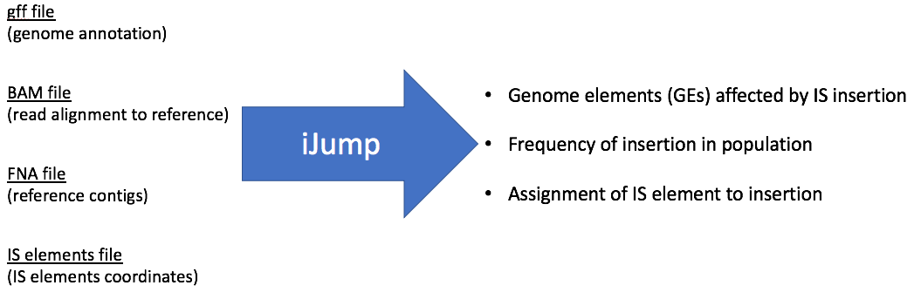

# iJump


Software for search of Insertion Sequences (IS) rearrangements in evolved population sequencing data.
*Program is in a development stage, and I will appreciate any feedback.*

**iJump** searches for IS elements rearrangements in evolved populations of single organism and estimates what fraction of a population is affected by the rearrangement. iJump uses soft-clipped reads to find evidense for rearrangements. 

**NOTE:** Working with short-read-only assembled genomes is difficult with iJump. The reason is that usually IS elements are repetitive regions which are difficult to resolve for assemblers. This often result in shreading IS elements to several/many sometimes overlapped short contigs. This introduces difficulty either for boundaries determination and for mapping algorithms.

**Unreleased:** Dropped the `pysamstats` dependency; `average_depth`'s coverage
calculation is now pure `pysam` (a per-read CIGAR/span accumulator, no pileup),
verified to reproduce `pysamstats`' true (unrounded) coverage mean exactly across
supplementary reads, internal deletions/ref-skips, and zero-coverage windows. This
also fixes a pre-existing bug: `average_depth` previously called `statistics.mean()`
on a `numpy.int32` coverage array, which truncated every fractional mean down to an
integer. Coverage means (and, in `--estimation_mode average`, the `Depth` column and
everything derived from it) are now the correct, unrounded float — if you compare a
new run's `Depth`/`Frequency` values against one from an earlier version, expect
`Depth` to gain a fractional part it previously lost, and `Frequency` (which divides
by `Depth`) to shift slightly *downward* as a result, since the old truncated,
smaller `Depth` inflated it.

**v1.0.4:** Fixed a bug (`--estimation_mode precise` was compared against the misspelled
`'presice'`) where the `IS pos` column of `ijump_junctions.txt` in precise mode was left
0-based while `Position` on the same row was already 1-based. `IS pos` is now converted to
1-based too, so if you compare a new run's `ijump_junctions.txt` against one produced by an
earlier version, `IS pos` will be shifted by 1.

## Content

- [Motivation](#motivation)
- [Installation](#installation)
  - [Conda](#conda)
  - [Docker](#docker)
  - [Development setup](#dev-setup)
    - [Releasing to PyPI](#releasing)
- [Usage](#usage)	
  - [Input](#input)
    - [IS table](#mecf)
	- [Reference Fasta](#ref_fasta)
	- [GFF file](#gff)
	- [BAM file](#bam)
- [Run iJump](#run)	

<a name="motivation"></a>
## Motivation

Genome rearrangements and especially IS rearrangements are powerful tools for evolution in all domains of life. Currently very few software tools exists that can work with data of mixed populations, not the clonal ones.
The goal of the iJump is to estimate frequency of rearrangements in the evolved population. The scenario that was in our mind is following:

1) Bacterial population is going through experimental evolution.
2) During the evolution process the initial population split into several subpopulations.
3) In subpopulations various IS rearrangements occur.

The only tool for bacterial population data that was found is a [*breseq*](http://barricklab.org/twiki/bin/view/Lab/ToolsBacterialGenomeResequencing). However although it is an excellent and comprehensive tool we've found couple limitations of its use. (1) It very slow on high coverage data and (2) it is impossible to use only selected analysis tools.

<a name="installation"></a>
## Installation

**iJump** do not need special installation. Just clone repository:
```
git clone https://github.com/sleyn/ijump.git
```

But it is dependent on several Python libraries:
* **pandas**
* **pysam**
* **numpy**
* **scipy**
* **sklearn**

<a name="'conda"></a>
### Conda

`environment.yml` at the repo root is the single source of truth for the
conda environment (Python version, `blast`, `pysam`, and the rest of the
runtime deps from `pyproject.toml`, from the `bioconda` and `conda-forge`
channels). It only installs the dependencies — install
`ijump` itself into the resulting environment (editable mode, for local
dev) to get a working `ijump` command:

```
conda env create -f environment.yml
conda activate ijump
pip install -e . --no-deps
ijump --help
```

For a locally-built, non-editable conda package instead (installs `ijump`
as a normal package rather than `pip install -e .`), use the `meta.yaml`
conda-build recipe also at the repo root:

```
conda install -n base conda-build   # one-time, if not already installed
conda build .
conda install --use-local ijump
```

<a name="docker"></a>
### Docker

A `Dockerfile` at the repo root builds a self-contained image from this
checkout -- no prior PyPI publish needed. BLAST+ (`blastn`, `makeblastdb`)
comes from `apt-get install ncbi-blast+` and the `ijump` package itself is
installed with [`uv`](https://docs.astral.sh/uv/):

```
docker build --platform linux/amd64 -t ijump .
docker run --rm ijump --help
```

(`--platform linux/amd64` is required when building on an Apple
Silicon/arm64 host -- see the tradeoff note below for why.)

`ijump`'s subcommands (`run`, `combine-results`, `isfinder-db-parse`) are
the image's `ENTRYPOINT`, so any flags after the image name go straight to
the console script. Input files (BAM, reference FASTA, GFF, mobile-elements
coordinates file) are user-supplied at runtime, not baked into the image --
mount them (and an output directory) as volumes:

```
docker run --rm \
    -v "$(pwd)/Example files":/data:ro \
    -v "$(pwd)/out":/out \
    ijump run \
        --aln /data/sample.bam \
        --ref /data/reference.fasta \
        --gff /data/reference.gff \
        --isel /data/mobile_elements.txt \
        --outdir /out
```

See [Usage](#usage) below for what each of `--aln`/`--ref`/`--gff`/`--isel`
expects, and `docker run --rm ijump run --help` for the full flag list
(including `--wd` for the intermediate work directory, which defaults to
`ijump_wd` under the current directory and should usually be mounted or
redirected too if you want to keep it after the container exits).

**Known tradeoff, verified end-to-end with a live `docker build
--platform linux/amd64 .` and `docker run` (`blastn -version`,
`makeblastdb -version`, `import pysam, pysamstats`, and a full `ijump run`
against `tests/fixtures/tiny.bam`/`.fna`/`.gff` mounted as volumes, all
succeeded and produced the expected output files):** the image pins
Python **3.8**, not `environment.yml`'s 3.11. Reason: `pysamstats` 1.1.2
(see the [uv](#uv) section above for the full writeup) hard-pins
`pysam<0.16`, and `pysam==0.15.4`'s last PyPI wheel lineage only goes up
to `cp38` (`manylinux2010_{x86_64,i686}` plus a macOS Intel wheel; no
arm64 wheel at any Python version) -- confirmed directly against PyPI's
file listing for that release. Anything newer forces a from-source
`pysam` build that's independently confirmed broken on current toolchains
(see the `uv` section). Pinning the image to Python 3.8 (still satisfies
`pyproject.toml`'s `requires-python = ">=3.7"`) is what makes
`pysam==0.15.4` install from a prebuilt wheel instead of building from
source, which in turn makes `pysamstats`' bundled precompiled `opt.c`
buildable against matching pysam headers with just a C compiler and zlib
headers (`build-essential` + `zlib1g-dev`, installed via apt in the
image). No `uv.lock` is committed (same reason -- see the `uv` section),
so the Dockerfile does not use `uv sync --frozen`; instead it runs `uv
pip install --system` for the resolvable dependencies, then installs
`pysam==0.15.4` and `pysamstats==1.1.2 --no-deps` as a deliberate
two-step workaround for the metadata pin conflict, then installs `ijump`
itself with `--no-deps` (every dependency it declares has already been
installed explicitly).

Because there's no arm64 wheel for `pysam==0.15.4`, `docker build .` on
an Apple Silicon (or other arm64) host **must** pass `--platform
linux/amd64`, or the build falls back to building `pysam` from source and
fails (no cython, no precompiled `.c` in the sdist -- the same failure
already documented in the `uv` section above). `import pysam,
pysamstats` also prints a benign `PileupColumn size changed, may indicate
binary incompatibility` `RuntimeWarning` at runtime (pysamstats' compiled
`opt.c` was built against pysam 0.15.4's exact struct layout, which
differs slightly from later ABI expectations at the Python-object level);
it does not affect correctness -- confirmed by calling
`pysamstats.load_coverage` directly against `tests/fixtures/tiny.bam` and
getting real, correct coverage numbers back. Reconciling the apt-sourced
BLAST+ version against `environment.yml`'s pin is left as follow-up work
(explicitly out of scope for this ticket).

<a name="dev-setup"></a>
### Development setup

iJump's Python code lives under `src/ijump/` and is packaged as a normal
`ijump` distribution (`pyproject.toml`, PEP 621, setuptools src-layout
backend). To work on it, or to run the test suite, install it in editable
mode into your environment (conda or venv):

```
pip install -e .
```

This makes `import ijump`, `from ijump.isclipped import ...`, etc. resolve
from anywhere without any manual `PYTHONPATH`/`sys.path` fiddling, and is
what `pytest` (run from the repo root) relies on to import the package
under test. The tests additionally require `pysam`, which has prebuilt
wheels for current Python/platform combinations and installs fine via
plain `pip`/`uv` (unlike the now-removed `pysamstats`, which pinned
`pysam<0.16` and forced a conda install — see the `uv` section below,
whose documented `pysam`/`pysamstats` build failure predates that
removal and describes a conflict that no longer exists for a plain
`pysam` install).

<a name="uv"></a>
#### uv

[`uv`](https://docs.astral.sh/uv/) is the intended tool for local dev
(venv + dependency sync), running tests, and building/publishing the
package:

```
uv sync                 # create .venv/ and install project + dependencies
uv run pytest           # run the test suite inside that venv (replaces bare `pytest`)
uv run ijump --help     # run the console script from a checkout (replaces an installed `ijump`)
```

#### Lint / pre-commit

`ruff` (lint + format) and `mypy` (type checking) are configured in
`pyproject.toml`'s `[tool.ruff]` / `[tool.mypy]` sections, scoped to
`src/ijump/`, and enforced both locally via `pre-commit` and in CI via
`.github/workflows/lint.yml`. Install the git hook once per clone so lint
issues are caught before they're committed rather than only in CI:

```
uv run pre-commit install
```

(if `uv sync` isn't usable yet on your machine because of the
`pysam`/`pysamstats` limitation above, `pip install pre-commit &&
pre-commit install` works the same way — `pre-commit` itself has no
dependency on the project's runtime deps.) After that, `git commit` runs
`ruff check --fix`, `ruff format`, and `mypy src/ijump` automatically; run
them over the whole repo at any time with:

```
pre-commit run --all-files
```

**Known limitation, verified on this machine (macOS/arm64, Python 3.13,
`uv 0.11.8`): `uv sync` / `uv lock` (and therefore `uv run` against a
project venv) currently fail outright, before installing anything, and
this is not a `uv`-specific bug.** The chain of causes:

1. `pysamstats` 1.1.2 — the newest release on PyPI, last published in
   2018 — hard-pins `pysam<0.16` in its own `install_requires`, so any
   resolver (`uv`, or plain `pip`) is forced onto `pysam==0.15.4`
   regardless of what `ijump`'s own `pyproject.toml` asks for.
2. `pysam==0.15.4` has no prebuilt wheels for modern Python/platform
   combinations, so it has to build from its sdist. That build fails in a
   PEP 517 isolated environment with a plain `ModuleNotFoundError: No
   module named 'pkg_resources'` (its bundled build script assumes
   `pkg_resources` is present).
3. Supplying `pkg_resources`/an older `setuptools` gets one step further,
   then hits a second, deeper failure: `pysam`'s sdist has no
   precompiled `.c` sources checked in for this Cython/Python
   combination, so it needs `cython` installed too — and even with
   `cython` and `setuptools<81` pre-installed and `--no-build-isolation`,
   the native build still fails during `setup.py egg_info`/build (this
   was verified directly with plain `pip install --no-build-isolation
   pysam==0.15.4`, independent of `uv` entirely, to confirm this isn't a
   `uv`-only problem).

In short: `pysamstats` 1.1.2 is an unmaintained package pinned to an
equally old, no-longer-buildable `pysam` release, and no combination of
`uv`/`pip` flags gets a plain PyPI source resolve working for it on a
current Python. Because of this, `uv.lock` cannot honestly be generated
for this project's real dependency set right now, and none is committed —
generating one by loosening/removing the `pysam`/`pysamstats`
requirement would just hide the problem rather than fix it. This is
exactly the gap ticket 04 (conda packaging) exists to close: conda
provides prebuilt `pysam`/`pysamstats` binaries and sidesteps the source
build entirely.

What *does* work with `uv` today, verified on this machine:

* `uv build` — produces a wheel and sdist without touching runtime
  dependency resolution at all (the `setuptools.build_meta` backend from
  ticket 01 needs no changes; it works as-is under `uv build`).
* Anything that doesn't require `uv` to sync a project venv first.

Until `pysam`/`pysamstats` are available as installable wheels (or ticket
04's conda environment is the one providing them), keep using the
existing conda-based install above for actually running/testing iJump
locally (`conda install ...` + `pip install -e .`); treat `uv sync`/`uv
run pytest`/`uv run ijump` as the target workflow this project is moving
towards, not yet as something that works end-to-end from a clean clone.

<a name="releasing"></a>
#### Releasing to PyPI

Cutting a release is a `uv build` + `uv publish` away once maintainers
decide to actually do it (this is documentation for that future action,
not something done as part of routine dev work):

```
uv build                                   # writes dist/*.whl and dist/*.tar.gz
uv publish --token <PyPI API token>        # uploads dist/* to PyPI
```

`uv build` only needs the `[build-system]` section of `pyproject.toml`
(currently `setuptools.build_meta`, unchanged) and does not require
`pysam`/`pysamstats` to resolve or install — it was verified to succeed
on this machine even while `uv sync`/`uv lock` cannot (see above). The
`ijump` name was confirmed available on PyPI (`pypi.org/pypi/ijump/json`
returned 404) as of ticket 03's grilling session; re-check before
actually publishing in case it's been claimed since. `uv publish` needs a
PyPI API token (`--token` or the `UV_PUBLISH_TOKEN` env var) — no token
was used and nothing was published as part of this work.

<a name="usage"></a>
## Usage

<a name="input"></a>
### Input

iJump requires four files for input:
 1. File with mobile elements coordinates
 2. Reference DNA contigs fasta file.
 3. GFF file with reference genome annotations.
 4. BAM file of aligned Illumina reads.



<a name="mecf"></a>
#### IS table

The IS table — the file with mobile element coordinates — is a tab-separated table with a
header row:
```
is_name	contig	start	stop	family	group	cluster	pident	wraps_origin	element_id
```

For example:
```
is_name	contig	start	stop	family	group	cluster	pident	wraps_origin	element_id
ISAcsp3_1	NODE_1	2980551	2981283	IS3	IS3	ISAcsp3	99.454	no	
```

`family`, `group` and `pident` are the ISFinder family and group of the element and the
percent identity of the hit it was called from. `cluster` groups the rows that are copies
of one mobile element — see [Clusters](#clusters) below. `wraps_origin` and `element_id`
mark the copies an assembler broke at a contig boundary — see
[Origin-spanning elements](#origin-spanning) below. All of them are filled in by the
**isfinder-db-parse** subcommand below; if you write the table by hand you may leave them
empty.

Tables in the older headerless four-column format (name, contig, start, stop) are still
accepted — they are recognised by the missing header row and read with the annotation
columns empty.

If you don't have file with coordinates of mobile elements you can do a manual BLAST against the standalone ISFinder database. The database could be downloaded from:

- [ISFinder original GitHub](https://github.com/thanhleviet/ISfinder-sequences)
- [My Fork](https://github.com/sleyn/ISfinder-sequences) with already built BLASTn database.

Do BLASTn search:

```
blastn -query <Genome> -db <BLASTn database from IS.fna> -out <Output file> -outfmt 6
```

Parse the output table with the **isfinder-db-parse** subcommand:
```
ijump isfinder-db-parse -b <BLAST output in outfmt 6 format> -r <Reference fasta> -o <Output directory>
```

The parser will find non-overlapping hits with empirical E-value threshold 1E-30. The
reference fasta is the genome the BLAST search was run against; each called element is
extracted from it and compared with all the others to fill in the `cluster` column.

<a name="clusters"></a>
##### Clusters

`is_name` is the nearest ISFinder database entry plus a copy number, which is not a
reliable way to tell which rows are the same mobile element. Two fragments of one element
can land on different database entries and get different names, while two elements 15%
apart can land on the same entry and share one. So iJump groups the rows by aligning the
elements against each other: two elements share a cluster when they align at **≥95%
identity over ≥80% of the shorter** of the two, and clusters are closed under single
linkage — a fragment reaches a parent it shares no alignment with, through a sibling that
aligns to both.

Both thresholds are flags: `--cluster-identity` (percent, default 95) and
`--cluster-coverage` (fraction, default 0.8).

Coverage is measured on the *shorter* element on purpose: a read clipped at a 76 bp
remnant of an element cannot be told from one clipped at a full copy of it, so the remnant
belongs with its parent.

Single linkage can chain — a fragment landing in a stretch conserved between two distinct
elements merges them — and nothing in the alignment says whether a given chain is wanted.
So the parser logs a warning naming both elements for every pair that shares a cluster
without meeting the threshold itself. Read those warnings, and edit the `cluster` column
before running the pipeline if two of them are different elements.

The cluster is what both modes group by — precise mode pairs junctions per cluster, average
mode reports one entry per cluster — so a table without one (a legacy four-column table, or
one with the column left blank) stops a run before it starts, naming `ijump migrate-is-table`
as the remedy.

<a name="origin-spanning"></a>
##### Origin-spanning elements

A circular replicon has to be broken somewhere to be written out as a linear contig, and
the break can land inside an IS copy. That copy is then called as two rows: one ending at
the last base of the contig, one starting at its first. Both rows are kept — they are
separate spans and the junction search needs both — but each is marked `wraps_origin=yes`
and carries an `element_id` shared with its other half, so the table says the assembly,
not the genome, put a boundary through the middle of an element.

Two rows are marked only when they share a cluster *and* a contig and sit at its opposite
ends — within 20 bases of one, since the alignment that called a fragment can fray a base
or two short of the boundary. An element merely near the end of a contig, with nothing at
the origin to join, is not marked.

<a name="ref_fasta"></a>
#### Reference Fasta

Regular Fasta file with one Fasta-record per contig:

```
>Contig1
gctagctagctagctacgtagctagctagctacgtacgtacgtagcta...

>Contig2
cgtagctgctagctagctagctagcgtacgtacgtagctacgtacgta...

...
```

<a name="gff"></a>
#### GFF file

iJump is working with it's own gff module that is tuned for PATRIC/PROKKA-style GFF.

Some specifications:
- The comment string `##sequence-region	accn|[contig name]	[contig start coordinate]	[contig end coordinate]` is required for each contig in the reference.
- Info field should have the following fields:
  	
	- ID
	- product
	- locus_tag
	- (optional, if gene has trivial name) gene

Example:

```
##gff-version 3								
##sequence-region	accn|NODE_1_length_3909467_cov_533.478_ID_22129	1	3909467					
NODE_1_length_3909467_cov_533.478_ID_22129	FIG	CDS	34	336	.	-	1	ID=fig|400667.82.peg.1;product=hypothetical protein;locus_tag=AUO97b_00141
NODE_1_length_3909467_cov_533.478_ID_22129	FIG	CDS	352	1578	.	-	1	ID=fig|400667.82.peg.2;product=phage replication protein Cri;locus_tag=AUO97b_00142;gene=cri
NODE_1_length_3909467_cov_533.478_ID_22129	FIG	CDS	1724	2098	.	+	2	ID=fig|400667.82.peg.3;product=helix-turn-helix family protein;locus_tag=AUO97b_00143
```

If you have another style of GFF unfortunately you have to reformat it at the current stage of development.

<a name="bam"></a>
#### BAM file

BAM file with aligned short reads. BAM file should contain soft-slipped reads. On the current stage iJump don't use hard-clipped reads.

**NOTE:** If you have aligner (like BWA-mem) that produses both soft- and hard-clipped reads you should use option to use only soft-clipped reads or multiply frequency assessments by 2.

<a name="run"></a>
### Run iJump

iJump has two workflows:
1. ["Average"](./docs/Average.md). iJump estimates frequency of IS element insertions in genes or intergenic region based on average coverage of the gene. This workflow is original and made to estimate the case of very heterogeneous populations. This workflow has low accuracy. However it has a good sensistivity.
2. ["Precise"](./docs/Precise.md). iJump will try to localize insertion coordinates first and then estimate frequency of insertion in population. Less tested but logically more correct.

Example of "Average" workflow:
```
ijump run \
    -a Sample.bam \
    -r Escherichia_coli_BW25113.fna \
    -g Escherichia_coli_BW25113.gff \
    -i ISTable_processing.txt \
    -o average_out
```

Example of "Precise" workflow:
```
ijump run \
    -a Sample.bam \
    -r Escherichia_coli_BW25113.fna \
    -g Escherichia_coli_BW25113.gff \
    -i ISTable_processing.txt \
    --estimation_mode precise \
    -o precise_out
```

Available parameters:
```
usage: ijump run [-h] [-a ALN] [-r REF] [-g GFF] [-i ISEL] [-c] [-o OUTDIR]
                 [-w WD] [--radius RADIUS] [--estimation_mode ESTIMATION_MODE]
                 [--version]

iJump searches for small frequency IS elements rearrangements in evolved
populations

optional arguments:
  -h, --help            show this help message and exit
  -a ALN, --aln ALN     BAM or SAM alignment file
  -r REF, --ref REF     Reference genome in FASTA format
  -g GFF, --gff GFF     Annotations in GFF format for reference genome.
                        Required for average mode.
  -i ISEL, --isel ISEL  File with IS elements coordinates
  -c, --circos          Set flag to build input files for CIRCOS
  -o OUTDIR, --outdir OUTDIR
                        Output directory. Default: . (current)
  -w WD, --wd WD        Work directory. Default: ijump_wd (current)
  --radius RADIUS       Radius around IS elements boundaries to search soft
                        clipped reads.
  --estimation_mode ESTIMATION_MODE
                        Specifies how the IS frequency will be esimated.
                        'average' - by averaging the region coverage and
                        number of clipped reads. Or 'precise' - iJump will try
                        to separate each insertion event.
  --version             Print iJump version and exit.
```

### Reports name elements, not called loci

**Breaking change.** The per-region report and the region summary carry one entry per
[cluster](#clusters) — one per mobile element — where they used to carry one per row of the
IS table. On the reference genome the three entries `IS17_1`, `IS17_2` and `ISAba12_1`
become the single entry `ISAba12`: they are one copy and two of its own fragments, and
splitting one insertion's evidence across three entries both understated every frequency
and could hide an insertion under the reporting cutoff entirely.

Anyone reading `ijump_report_by_is_reg.txt` or `ijump_sum_by_reg.txt` by IS name — a script
selecting `IS17_1`, or a column index into the region summary — is broken by this and needs
updating to the cluster names. `ijump combine-results` handles it for you.

`ijump_report_by_is_reg.txt` -- and precise mode's `ijump_junction_pairs.txt` -- now begin
with a line naming the IS table the run was annotated against. These are the files
`ijump combine-results` merges; `ijump_sum_by_reg.txt` is not merged and is not stamped:

```
# ijump-is-table: c5775ee72813f8c2
```

Cluster names are derived from the loci rather than fixed labels, so the same name can mean
different elements in two runs annotated against different tables. `ijump combine-results`
joins samples on those names, so it reads this line and **refuses to merge samples whose
annotations disagree** rather than lining up names that mean different things. A report
written before this change carries no such line and is refused with a message saying to
rerun the sample.

### Compare samples

If you have several related samples and want to compare them side by side you can copy all *ijump_report_by_is_reg.txt* files in one folder, rename them as *ijump_<*Sample name*>*.txt* and run:

```
ijump combine-results -d [Folder with ijump report files] -o [Output file with the combined table] -g [GFF file. If provided will add functional annotation of the region]
```

This will merge all results in one table.

Available parameters:

```
ijump combine-results -h
usage: ijump combine-results [-h] [-d DIR_REPORT] [-o OUTPUT] [-g [GFF]]
                             [-p PREFIX] [-m IJUMP_MODE] [--lab_format]
                             [--clonal] [-a [A_SAMPLES]]
                             [--precise_mode PRECISE_MODE]

Tool that combines ijump reports from several files into one summary table

optional arguments:
  -h, --help            show this help message and exit
  -d DIR_REPORT, --dir_report DIR_REPORT
                        Directory with report files
  -o OUTPUT, --output OUTPUT
                        Output table file
  -g [GFF], --gff [GFF]
                        Path to gff file
  -p PREFIX, --prefix PREFIX
                        If set would be used as prefix
  -m IJUMP_MODE, --ijump_mode IJUMP_MODE
                        Variant of iiJump pipeline: "average" or "precise".
                        Default: "average"
  --lab_format          If set, output internal laboratory
  --clonal              If set, runs clonal merging
  -a [A_SAMPLES], --a_samples [A_SAMPLES]
                        Path to folder with unevolved population samples. Used
                        for clonal analysis.
  --precise_mode PRECISE_MODE
                        If "dense" mode selected iJump will try to combine and
                        sum observations based on one edge. For example: If
                        observation 1 has coordinates 100-105 and other 100-0
                        (right junction is undefined) the results will be
                        combined. The options are "dense" and "sparse".
                        Default: dense

```
